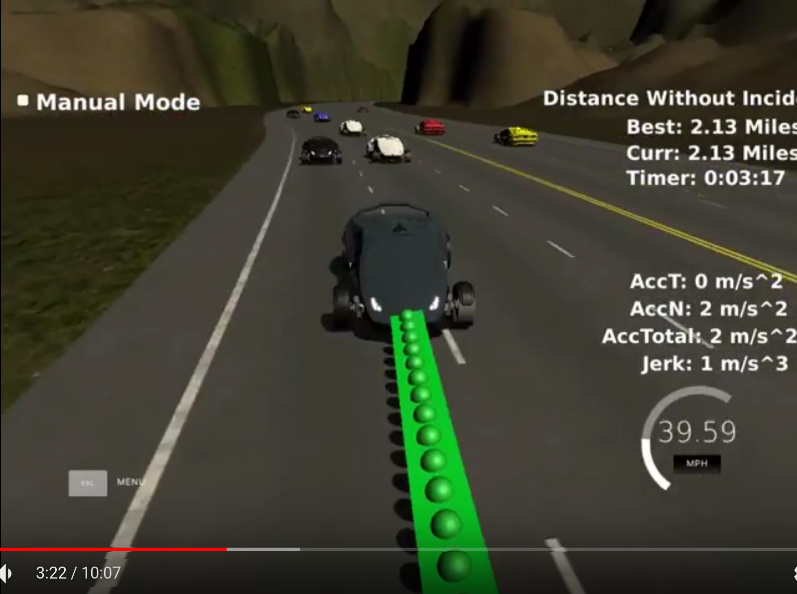
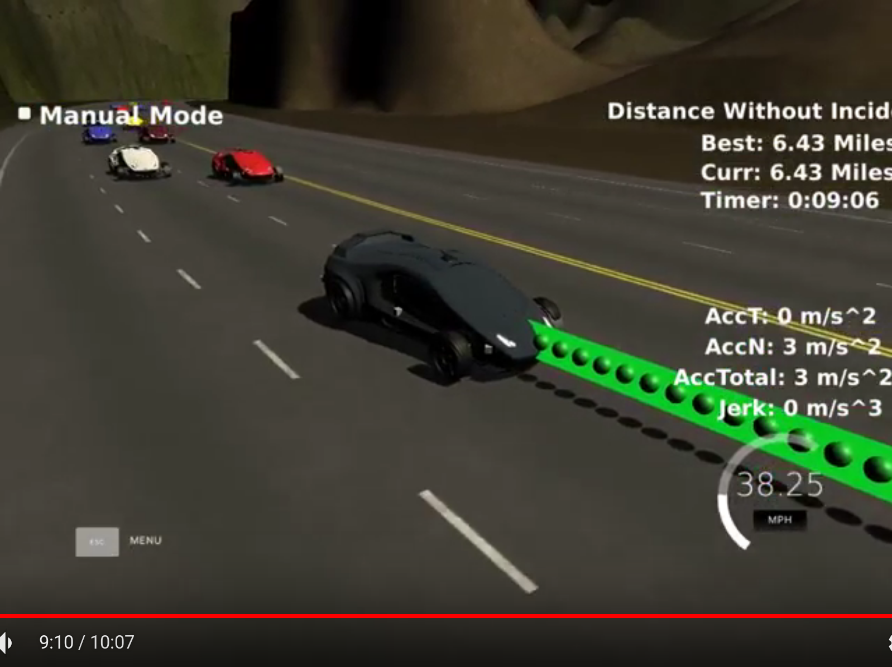
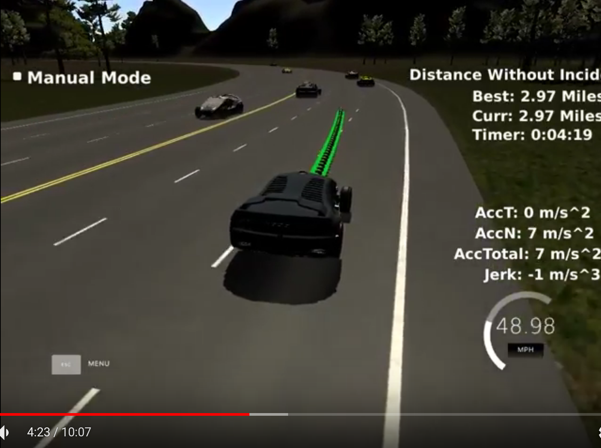
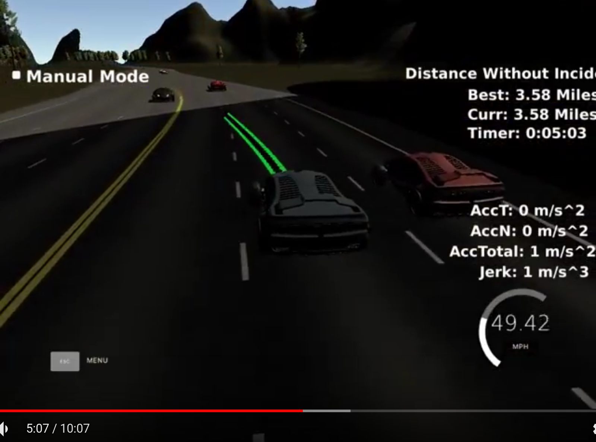

# Project write-up

## Project

In this project the simulator can perfectly drive through the points given by an application. On each step the simulator provides current car position in Cartesian and Frenet coordinates, velocity, points left from the previous step and sensor fusion data that contains information about other vehicles. An application must return points through which simulator continues car's way. As the car goes forward while an application computes next waypoints, the simulator may use few more points from the previous list of points. The car visits new point every 20 ms, it allows to define a velocity by varying the distance between neighboor points.

The path provided by an application must meet the following criteria:
* The car must be within its lane (3 lanes on the right part of the road) all the time except for the lane change, which must not take more than 3 seconds.
* The car must not drive faster than the speed limit, which is 50 mph for this project.
* The car must not exceed a total acceleration of 10 m/s^2 and a jerk of 10 m/s^3.
* The car must not collide with other cars on the road.
* The car must be able to change its lane when it makes sence.

## Approach

Please find below 10 minutes video with my final approach.

My final solution is implemented in Driver class. It may be divided into two parts:
* UpdatePath function which computes actual points for the path and maintains speed within limits.
* ChooseLane function which analyzes the current and adjacent lanes and chooses the best lane to go.

The UpdatePath function is based on the method described in the project walkthrough video. It uses two last points from the previous path (it derives them from the current car position at the begining) and points that lies 30, 60 and 90 meters ahead on the target lane. Then given these points the function computes smooth path going through them using splines. The velocity of the car remains the same if it lays near the speed limit or the ahead car. It the curent lane is free the velocity is increased, otherwise it is decreased. This method allows to build the path that meets above criteria on its smoothness, a total acceleration and a jerk and speed limit.

The ChooseLane function at first checks if the car changes its lane at the moment. Then it checks whether the car reached the target lane and if not the function does nothing, that allows to wait until the end of maneuver. If the does not change its lane then the function tries to find better lane to drive through it. The lane is considered as better lane than the current one if it is drivable (i.e. there is no any vehicle near the ego's car in the 20 meters gap ahead or behind the car) and the car may go faster on this lane. The function penalizes changing lanes too often by increasing current velocity while consdidering alternatives. If other vehicle behind ego's car goes faster then such lane is considered not drivable (it does not applicable to the current lane).

## Criteria

> The code compiles correctly.

> Code must compile without errors with cmake and make.

> Given that we've made CMakeLists.txt as general as possible, it's recommend that you do not change it unless you can guarantee that your changes will still compile on any platform.

The code compiles correctly using GCC 5.5 and CMake. I modified a little CMakeLists.txt for working around GCC 5.5 bug and turning on C++17.

> The car is able to drive at least 4.32 miles without incident..

> The top right screen of the simulator shows the current/best miles driven without incident. Incidents include exceeding acceleration/jerk/speed, collision, and driving outside of the lanes. Each incident case is also listed below in more detail.

The car is able to drive a least 7 miles without incidents as it is shown on the video above.

> The car drives according to the speed limit.

> The car doesn't drive faster than the speed limit. Also the car isn't driving much slower than speed limit unless obstructed by traffic.

The car drives at the speed near 49.5 mph and doesn't exceed the limit. It there is a vehicle ahead the car maintains its speed.

> Max Acceleration and Jerk are not Exceeded.

> The car does not exceed a total acceleration of 10 m/s^2 and a jerk of 10 m/s^3.

The velocity of the car can be increased or decreased by 0.1 m/s^2 each 20 ms. It allows to stay within these limits.

> Car does not have collisions.

> The car must not come into contact with any of the other cars on the road.

The car maintains safe speed for the current lane and it does not change lane if it is not safe.

Please find below the examples of maintaining safe distance before changing the lane.

> The car stays in its lane, except for the time between changing lanes.

> The car doesn't spend more than a 3 second length out side the lane lanes during changing lanes, and every other time the car stays inside one of the 3 lanes on the right hand side of the road.

The car drives within its lane all the time except for the lane change. The lane change does not take more than 3 seconds.

> The car is able to change lanes

> The car is able to smoothly change lanes when it makes sense to do so, such as when behind a slower moving car and an adjacent lane is clear of other traffic.

The car can change the lane if it allows to drive faster and may be considered safe.

Please find below the examples of such maneuvers on the video.

